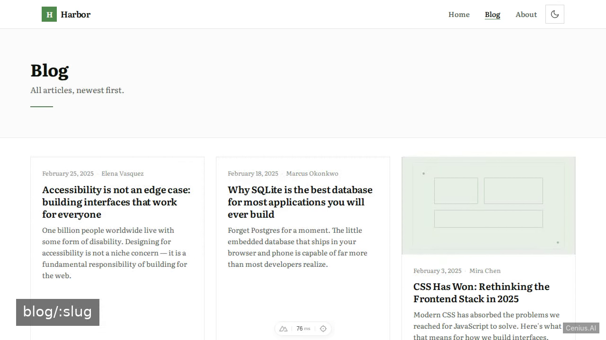
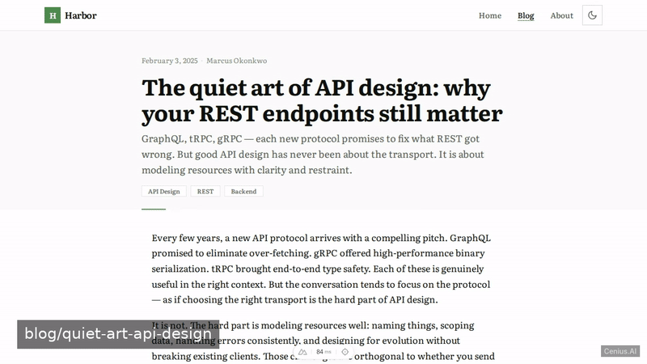
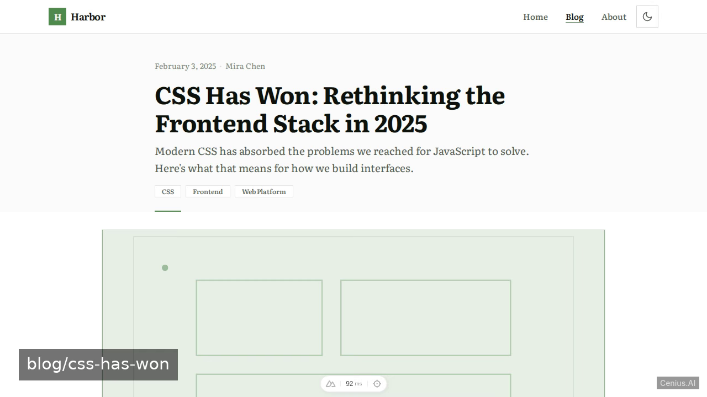
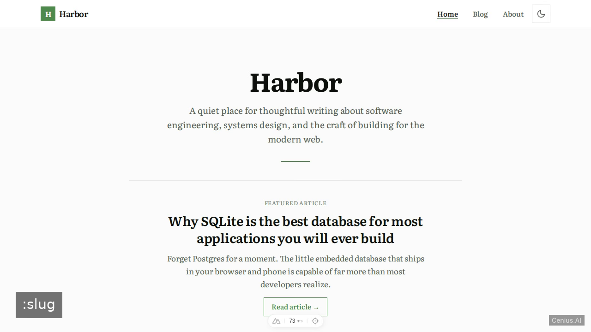

# Harbor — complete Full-stack app blog platform example app

A modern tech blog built with Nuxt 3 and Nuxt Content. That's **Harbor** — a Apache-2.0-licensed, open-source blog platform in Full-stack app you can self-host and modify freely. Fork Harbor, run it, or [remix it on cenius.ai](https://cenius.ai/marketplace/p/harbor?ref=gh&utm_campaign=harbor-webapp) for a custom Harbor build with full rebrand rights.


[](LICENSE)  [](https://cenius.ai)

[](https://cenius.ai/marketplace/p/harbor?ref=gh&utm_campaign=harbor-webapp)

> **▶ [Open & edit in cenius.ai](https://cenius.ai/marketplace/p/harbor?ref=gh&utm_campaign=harbor-webapp)** — one click to an editable workspace: describe changes in plain English, get an instant preview, one-click deploy and host. Modifications made on the platform come with full rebrand & relicense rights.

_Local clone? See [Quick start](#quick-start) below. cenius.ai is the zero-setup path._

## Demo





▶ **[Watch the full demo video](https://cenius.ai/marketplace/p/harbor?ref=gh&utm_campaign=harbor-webapp)** — the complete walkthrough, playing on the project's cenius.ai page · [MP4 file](.github/media/demo.mp4)

## Screenshots

  

## Architecture

Full-stack app project, delivered as a complete runnable codebase (382 files). Top-level layout: `assets/`, `components/`, `composables/`, `content/`, `layouts/`, `pages/`, `public/`. `install.sh` wires up dependencies and loads seed records; after it runs the app has real data to show. For environment-specific setup, see [`INSTALL.md`](INSTALL.md).

## Features

- Featured Posts on Home
- Blog Listing with Pagination
- Blog Post Detail
- Light/Dark Mode Toggle
- Responsive Design
- About Page
- SEO & Meta Tags
- Global Navigation

## Quick start

```bash
./install.sh   # installs dependencies + seeds demo data
```

See [`INSTALL.md`](INSTALL.md) for full setup and usage instructions.

## Usage guide

Harbor is a statically generated blog (or SSR with Nuxt) that runs in a browser. Once the development server is running, open `http://localhost:3000` in your browser.

### Pages & Navigation

#### Home page (`/`)

- Shows the blog title, subtitle, and a featured hero article (the most recent post with `featured: true` in its frontmatter).
- Displays a grid of up to 4 more featured articles below the hero.
- Click **Read article** on the hero post or any **PostCard** to go to the full article.
- Click **View all posts** to go to `/blog`.

#### Blog listing (`/blog`)

- Lists all articles (newest first) in a paginated grid (6 per page).
- Use the **Prev** / **Next** buttons at the bottom to navigate pages.
- Click any card to open the full article.

#### Single post (`/blog/:slug`)

Displays the full content of a Markdown file from `content/blog/[slug].md`.

- Shows the title, date, author, tags, and cover image (if provided).
- Renders the Markdown body using `ContentRenderer`.
- At the bottom, a **Related reading** section shows up to 3 other recent posts.

#### About (`/about`)

Renders the `content/about.md` file. If the file is missing or empty, a placeholder message is shown.

#### 404 page (`/anything-else`)

Any route not matched by the above falls through to the catch-all `pages/[...slug].vue`, which displays a “404 - Page not found” page with a link back home.

### Theme Toggle

A **ThemeToggle** component (visible in the header) switches between light and dark mode. The selection is stored in the browser via `useTheme` composable and persists across page loads.

_Full guide: [`USAGE.md`](USAGE.md)_

## FAQ

### What's the quickest way to self-host Harbor?

Clone this repository and run `./install.sh`, then start the app as described in [`INSTALL.md`](INSTALL.md). Harbor is fully self-hostable — no external services are required to try it.

### Can I remove the Harbor name and use my own?

Yes. You can edit the source directly under the MIT license, or [remix it on cenius.ai](https://cenius.ai/marketplace/p/harbor?ref=gh&utm_campaign=harbor-webapp) — the platform route grants full rebrand and relicense rights over your derivative.

### Is it OK to ship Harbor as part of a product?

Yes — it ships under the Apache-2.0 license, which permits commercial use, modification and redistribution. The full text is in [LICENSE](LICENSE).

### What technologies are in Harbor's stack?

Harbor runs on Full-stack app. This repo holds the full production source: you can inspect every part of it before deploying. Highlights include about Page.

### What if I want to add features to Harbor without coding?

The easiest route: [visit the project on cenius.ai](https://cenius.ai/marketplace/p/harbor?ref=gh&utm_campaign=harbor-webapp), tell the platform what to change, and collect the updated build. No source-editing needed.

## License & rebranding

Released under the [Apache License 2.0](LICENSE) (© 2026 Cenius AI) — free for personal and commercial use. The Cenius name/logo are trademarks (see NOTICE).

**Need a customized version?** [Remix this app on cenius.ai](https://cenius.ai/marketplace/p/harbor?ref=gh&utm_campaign=harbor-webapp) — modifications made on the platform come with **full rebrand & relicense rights** over your derivative.

## Built with cenius.ai

This entire application — code, design, seeded demo data — was generated on **[cenius.ai](https://cenius.ai)** from a plain-English description.

- 🚀 [Build your own app on cenius.ai](https://cenius.ai)
- 🎛️ [Remix Harbor on the marketplace](https://cenius.ai/marketplace/p/harbor?ref=gh&utm_campaign=harbor-webapp) — open it in a workspace, prompt for changes, and ship your own version.

More open-source apps: [the Cenius-ai catalog](https://github.com/Cenius-ai) · [showcase index](https://github.com/Cenius-ai/showcase)
